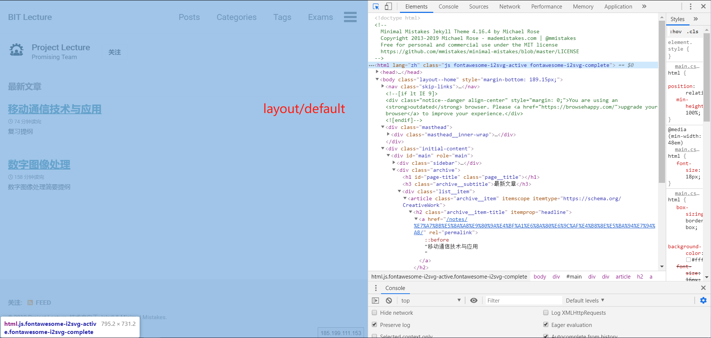
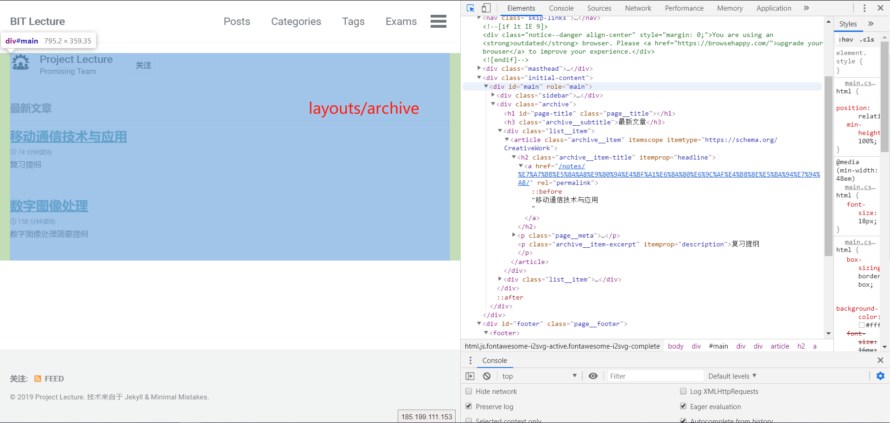
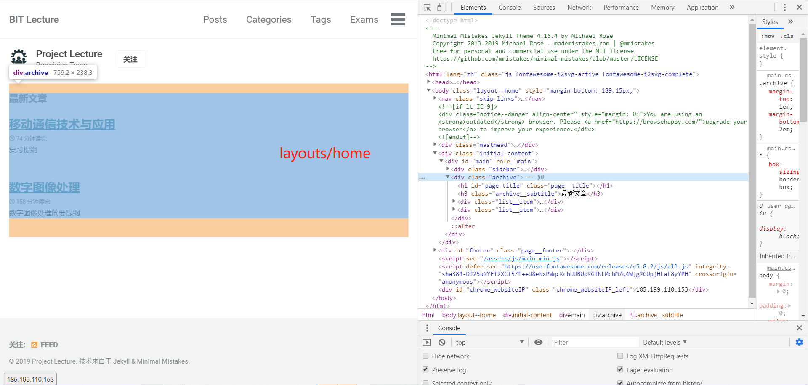
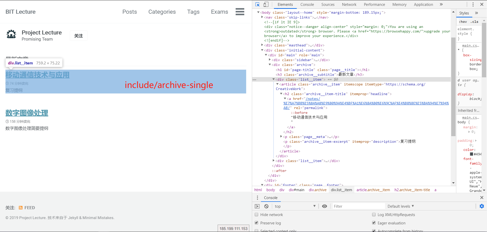

# BIT Lecture

<!-- MarkdownTOC autolink=true -->

- [上网不涉密 涉密不上网](#%E4%B8%8A%E7%BD%91%E4%B8%8D%E6%B6%89%E5%AF%86-%E6%B6%89%E5%AF%86%E4%B8%8D%E4%B8%8A%E7%BD%91)
- [编辑注意事项](#%E7%BC%96%E8%BE%91%E6%B3%A8%E6%84%8F%E4%BA%8B%E9%A1%B9)
  - [基本操作](#%E5%9F%BA%E6%9C%AC%E6%93%8D%E4%BD%9C)
  - [作者添加 - 签约成为马猴烧酒](#%E4%BD%9C%E8%80%85%E6%B7%BB%E5%8A%A0---%E7%AD%BE%E7%BA%A6%E6%88%90%E4%B8%BA%E9%A9%AC%E7%8C%B4%E7%83%A7%E9%85%92)
- [投稿&编辑细则](#%E6%8A%95%E7%A8%BF%E7%BC%96%E8%BE%91%E7%BB%86%E5%88%99)
  - [命名](#%E5%91%BD%E5%90%8D)
  - [头部标识](#%E5%A4%B4%E9%83%A8%E6%A0%87%E8%AF%86)
  - [内容](#%E5%86%85%E5%AE%B9)
  - [提交](#%E6%8F%90%E4%BA%A4)
- [改动说明](#%E6%94%B9%E5%8A%A8%E8%AF%B4%E6%98%8E)
- [目录说明](#%E7%9B%AE%E5%BD%95%E8%AF%B4%E6%98%8E)
  - [`_layout`](#_layout)
  - [`include`](#include)

<!-- /MarkdownTOC -->

Under construction.

Any suggestions mail to [our public email](mailto:bitlecturepublic@163.com)

**长期征收投稿，直接投稿至[邮箱](mailto:bitlecturepublic@163.com)即可。**

## 上网不涉密 涉密不上网

**请注意，投稿内容仅限于课程，请勿夹带私货，谨记第二校训，上网不涉密，涉密不上网。**


## 编辑注意事项

### 基本操作

对于有`push`权限的各位编辑，以`Windows`为例，推荐采用`GitHub Desktop`对`repo`进行`clone`，然后使用自己喜欢的编辑器进行修改。推荐`Markdown`编辑器为`Typora`，推荐代码编辑器为`VS Code`。

由于大多数人不具备编辑基础，因此不推荐修改已有代码，而是建议仅对`.\_posts\`下的投稿进行修改。

### 作者添加 - 签约成为马猴烧酒

当有作者加入时，需要首先在`\_data\authors.yml`中增加作者记录。

```yaml
Shicong Liu:
  name        : "Shicong Liu"
  bio         : "-"
  avatar      : "/assets/images/Shostakovich.jpg"
  links:
    - label: "Email"
      icon: "fas fa-fw fa-envelope-square"
      url: "mailto:prophet1380@gmail.com"
    - label: "Website"
      icon: "fas fa-fw fa-link"
      url: "https://psycholsc.github.io"
```

以我本人为例，在后面直接加入这样一段即可。注意最外层的名字要求实名，里面的署名可以自定义，`bio`这里可以自由发挥。头像按照说明放在指定位置，并在这里标出即可。后面的`links`还可以加很多东西，可以参考官方文档进行添加。

添加了作者之后就可以在提交作品中进行署名啦。

## 投稿&编辑细则

**投稿接受任意可编辑文件。**

作者请直接提交到公共[邮箱](mailto:bitlecturepublic@163.com)

### 命名

投稿文件位置为`.\_posts\`，所有投稿文件按照规则命名

```
YYYY-MM-DD-Title.md
```

其中标题`Title`的空格也全部使用`-`填充。扩展名也可以是`markdown`。

---

### 头部标识

投稿文件需要指定的头部标识，典型的头部标识可以写作如下形式

```yaml
---
title:  "title"
excerpt: "excerpt"
date:   2019-6-20 15:31:47 +0000
categories: Notes
tags: 
  - "数字图像处理"
  - "傅里叶变换"
  - "滤波"
  - "卷积神经网络"
comments: true
header:
  image: assets/images/lenax3.png
#   caption: "Photo credit: [**Unsplash**](https://unsplash.com)"
toc: true
toc_label: "Table of Contents"
toc_icon: "cog"
author: Shicong Liu
coauthor: xxx
---
```

以上是`yaml`表示，标题和副标题可以填写与实际相符的内容，时间正确填写，后面的`comments`还没有开放，可以先不填（不写这一项）。

`catagories`可以提供一个分类方式，如上所述描述为`Notes`，大家此阶段可以自由添加，后面的`tags`是同理的。今后在文章足够多的时候才会进行门类与标签的规范化。

后面的`header`条目是编辑文章头部的内容，此处只添加了图像，图像可以添加引用来源`caption`。推荐采用`3:1`比例的图像。

`toc`是侧边导航栏，默认关闭，在这里手动开启，可选图标`icon`直接参考官方文档即可。如果希望将内容扩展到右侧的区域（这时导航栏将嵌入到主体中），则选择添加以下条目。

```yaml
classes:  wide
```

关于作者，需要在`\_data\authors.yml`中添加作者信息。每一位投稿人都可以根据个人信息进行填写，并且如上方式添加`author`即可在页面左侧看到作者的自定义信息。注意作者的头像信息需要放在`\assets\images\`下，并且在信息中对应。这里推荐采用正方形或近似正方形，主要内容集中在中心圆形内的头像，否则可能显示不全。

注意现在已经可以添加合作作者了，只需要在`toc`中增加一个`coauthor`条目，规则与`author`相同，目前限制合作作者数量为`1`，如果日后存在需求则还会补充。

---

### 内容

以上是关于文件头部的规则，关于内容，规则如下

1. 在文件开始处不需要使用一级标题再叙述一遍`title`，因为默认会将`title`设置为一级标题显示出来。

2. `layout`实际上是本页面功能的模板，有`default, archive, home, posts`等。不同的模板作用不同。

3. 当一篇文章存在多个作者的时候，可以采用`sidebar`方法进行配置，例如
   
   ```yaml
    sidebar:
      - title: "Role"
        image: http://placehold.it/350x250
        image_alt: "logo"
        text: "Designer, Front-End Developer"
      - title: "Responsibilities"
        text: "Reuters try PR stupid commenters should isn't a business model"
   ```
   
    `sidebar`方法支持的特性还很多，`author`就是使用`sidebar`组合出的一种形式，具体使用可以查看官方文档。

4. 内容中出现并列图像时可以使用`gallery`方法，例如
   
   ```yaml
    gallery:
      - url: /assets/images/unsplash-gallery-image-1.jpg
        image_path: assets/images/unsplash-gallery-image-1-th.jpg
        alt: "placeholder image 1"
      - url: /assets/images/unsplash-gallery-image-2.jpg
        image_path: assets/images/unsplash-gallery-image-2-th.jpg
        alt: "placeholder image 2"
      - url: /assets/images/unsplash-gallery-image-3.jpg
        image_path: assets/images/unsplash-gallery-image-3-th.jpg
        alt: "placeholder image 3"
   ```
   
    这时就定义了一个`gallery`，使用时可以
   
   ```html
    
   ```
   
    就可以在合适的位置进行插入。`caption`是下方注释标签。

5. 内联公式推荐采用换行的形式，不建议采用行内公式书写长表达式，换行形式输入可以避免一些`bug`，也会让公式形式更为美观。具体可以参考前面编辑后的文章。另外如果有人对插入公式的`latex`表达不够熟悉，可以参考[此网页](https://www.codecogs.com/latex/eqneditor.php)

   作为补充，下面给出插入公式时的一个`demo`

   ```markdown
   $$
   \begin{equation}
   \begin{split}
   \left\| x \right\|_p=\left( \sum\limits_{i=1}^n \mid x \mid^p \right)^{\frac 1 p}
   \end{split}
   \tag{0}
   \end{equation}
   $$
   ```

   插入效果为
   $$
   \begin{equation}
   \begin{split}
   \left\| x \right\|_p=\left( \sum\limits_{i=1}^n \mid x \mid^p \right)^{\frac 1 p}
   \end{split}
   \tag{0}
   \end{equation}
   $$
   其中中间一行是公式主体，`tag`可以给公式标号。

6. 图像插入的`demo`如下

   ```html
   <div style="text-align:center" title="fig.1">
   <p>Fig.0 CS Abstract </p>
   </div>
   ```

   插入效果为

   <div style="text-align:center" title="fig.1">
   <p>Fig.0 CS Abstract </p>
   </div>

   直接采用`html`方法置入，`src`是图像的位置，`width`描述插入图像的宽度，`style`给出的效果是居中。下面可以采用一个简单的标签描述图像的内容。

7. 如果对`LaTeX`不熟悉，**建议去[此网页](https://www.codecogs.com/latex/eqneditor.php)学习一下不同符号如何在`LaTeX`中表示**

8. 在书写英文内容时注意使用半角符号。

9. **还有很多注意事项暂时还来不及写完**

投稿中的一些新特性方法会在这里逐渐更新，希望投稿或编辑之前先查看近期的更新情况。

### 提交

这里只要将本地库`push`上去就好了，但是要记得把`push`的内容做好注释，尽量标记好时间，例如搜狗拼音输入法的标准时间格式`2019-6-20 22:12:17`

## 改动说明

- 增加返回顶部按钮（参考了codepen）
  
  直接在`assets/js/main.min.js`中加入了返回顶部的js，css部分在`include/head/custom.html`中添加。 
  
  TODO：将.js文件放在js/下单独引用

- 在`custom.html`中添加使用$ $的代码，以后编辑post无需在前面增加。

- 增加评论功能（选择`gitalk`，利用项目的`issue`功能），`config`配置在最后`comments`部分，`comments`的`div`放在了`single.html`的文章内容部分（具体位置见注释）。

## 目录说明

### `_layout`

- `default`: 默认的layout，其他层通过`layout: default`继承`default`
  
  

- `archive`: 用来罗列各个类别的文章，包含了上面的sidebar（按照category分类？）
  
  

- `home`: 如下所示
  
  

- `single`：每篇post的内容布局

### `include`

- `archive-single`: 在页面里显示单个post的介绍
  
  
